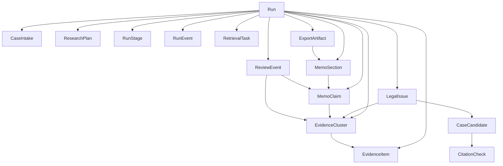

# V2 Evidence Graph and Audit Schema

Last updated: April 29, 2026

This document is the concrete output of issue `#24`.

It defines the canonical V2 evidence graph, audit relationships, durable identifier rules, and schema-versioning expectations for CAT-Loss War Room. It is written so later work on `#6`, `#10`, `#11`, and `#12` can converge on one stable contract instead of inferring product state from the current notebook-era audit snapshot.

## 1) Purpose

The current repo now has typed audit entities in `src/war_room/models.py`:

- `EvidenceItem`
- `EvidenceCluster`
- `MemoClaim`
- `ReviewEvent`
- `ExportArtifact`
- `RunAuditSnapshot`

Those are useful seeds, but they are still a v0 export-oriented view of the world.

V2 needs a fuller canonical graph that can support:

- run creation and progress tracking,
- evidence review,
- issue-organized legal analysis,
- memo composition,
- export history,
- and auditability across partial-success and human-review flows.

## 2) Core Principles

### Run-first, not memo-first

The primary persisted object is the run and its evidence graph.

The memo is a derived view over:

- intake,
- research plan,
- normalized evidence,
- legal issues,
- claims,
- review state,
- and export history.

### Evidence-first review

Every downstream object that asserts, summarizes, warns, or exports must point back into the same evidence graph.

### Stable graph, separate raw artifacts

Canonical entities live in the structured graph.

Raw retrieval payloads, fetched pages, PDFs, screenshots, and rendered files are separate artifacts referenced by the graph, not embedded as the graph itself.

### Review-required is graph state, not presentation-only state

`review_required` is allowed at multiple levels of the graph because uncertainty can attach to a run, a stage, an issue, an evidence cluster, a claim, or an export.

## 3) Current v0 Baseline vs Intended V2

### Current v0 baseline

The current implementation can already build a run-scoped audit snapshot for a rendered memo.

It includes:

- intake,
- query plan,
- evidence items,
- evidence clusters,
- memo claims,
- review events,
- and export artifact metadata.

That is enough for markdown export and regression testing, but not enough for a product runtime.

### Intended V2

V2 needs canonical persistence and API contracts for:

- run lifecycle,
- stage lifecycle,
- retrieval work,
- issue-level analysis,
- claim review,
- export history,
- and durable identifiers that do not depend on list position.

`RunAuditSnapshot` should remain useful as an export or audit bundle, but it should not be the top-level product persistence model.

## 4) Canonical Graph

The graph is run-scoped in v1 of the schema. Cross-run matter history can be layered later without changing the core object relationships defined here.

## 5) Canonical Entities

This section defines the minimum entity contracts V2 engineering should treat as canonical.

### `CaseIntake`

**Role**

Structured snapshot of matter facts used to plan and interpret a run.

**Durable ID**

- `intake_id`
- Stable within a run.
- If the product later supports reusable matter history, the run still stores an intake snapshot ID distinct from any editable matter profile ID.

**Minimum fields**

- `intake_id`
- `run_id`
- `event_name`
- `event_date`
- `state`
- `county_or_parish`
- `carrier`
- `policy_type`
- `posture[]`
- `key_facts[]`
- `coverage_issues[]`
- `created_at`
- `redaction_status`

**Relations**

- belongs to one `Run`
- feeds one `ResearchPlan`

### `ResearchPlan`

**Role**

Canonical planning object created after intake and before retrieval.

**Durable ID**

- `plan_id`

**Minimum fields**

- `plan_id`
- `run_id`
- `planned_modules[]`
- `issue_hypotheses[]`
- `query_specs[]`
- `preferred_domains[]`
- `estimated_scope`
- `created_at`
- `review_required`

**Relations**

- belongs to one `Run`
- references one `CaseIntake`
- is the planning input for `RetrievalTask`

### `Run`

**Role**

Top-level canonical execution record.

**Durable ID**

- `run_id`
- Must be globally unique and durable.
- Recommended implementation: UUIDv7 or ULID.

**Minimum fields**

- `run_id`
- `schema_version`
- `environment`
- `status`
- `review_required`
- `created_at`
- `started_at`
- `completed_at`
- `intake_id`
- `plan_id`
- `latest_export_artifact_id`

**Canonical statuses**

- `queued`
- `running`
- `partial_success`
- `failed`
- `completed`
- `cancelled`

**Relations**

- owns all other canonical entities in this document

### `RunStage`

**Role**

Stable progress record for one named stage in the workflow.

**Durable ID**

- `stage_id`
- Deterministic within a run.
- Recommended implementation: `run_id + stage_key`.

**Minimum fields**

- `stage_id`
- `run_id`
- `stage_key`
- `status`
- `review_required`
- `started_at`
- `completed_at`
- `summary`
- `error_summary`

**Canonical stage keys**

- `intake_validation`
- `research_plan`
- `weather`
- `carrier`
- `caselaw`
- `citation_verify`
- `memo_assembly`
- `export`

**Canonical stage statuses**

- `not_started`
- `in_progress`
- `completed`
- `degraded`
- `failed`
- `skipped`

### `RunEvent`

**Role**

Append-only event log for status changes, retries, warnings, and other operational facts.

**Durable ID**

- `run_event_id`

**Minimum fields**

- `run_event_id`
- `run_id`
- `stage_id`
- `event_type`
- `severity`
- `message`
- `created_at`
- `artifact_refs[]`

**Relations**

- belongs to one `Run`
- may reference one `RunStage`
- may reference raw artifacts or export artifacts

### `RetrievalTask`

**Role**

Provider-facing unit of retrieval work created from the research plan.

**Durable ID**

- `retrieval_task_id`

**Minimum fields**

- `retrieval_task_id`
- `run_id`
- `stage_id`
- `provider`
- `query_text`
- `status`
- `attempt_count`
- `requested_at`
- `completed_at`
- `raw_artifact_refs[]`
- `review_required`

**Relations**

- belongs to one `Run`
- belongs to one `RunStage`
- may generate many `EvidenceItem` records

### `EvidenceItem`

**Role**

Normalized evidence record derived from retrieval output.

**Durable ID**

- `evidence_id`
- Must be stable for a run regardless of UI ordering.
- Must not be assigned by display index.

**Minimum fields**

- `evidence_id`
- `run_id`
- `retrieval_task_id`
- `module`
- `evidence_type`
- `title`
- `summary`
- `url`
- `citation`
- `source_tier`
- `source_reason`
- `issue_hints[]`
- `review_required`

**Relations**

- belongs to one `Run`
- may belong to one or more `EvidenceCluster` records
- may be linked to one or more `LegalIssue` records

### `EvidenceCluster`

**Role**

Canonical grouping of related evidence items by durable identifier.

**Durable ID**

- `cluster_id`
- Must be derived from the canonical grouping key, not list order.

**Minimum fields**

- `cluster_id`
- `run_id`
- `cluster_type`
- `label`
- `evidence_ids[]`
- `module_set[]`
- `primary_url`
- `primary_citation`
- `review_required`

**Canonical cluster types**

- `citation`
- `url`
- `derived`

**Relations**

- belongs to one `Run`
- contains many `EvidenceItem` records
- can be linked to many `LegalIssue`, `MemoClaim`, and `ReviewEvent` records

### `LegalIssue`

**Role**

Issue-organized analysis node used by the Issue Workspace.

**Durable ID**

- `issue_id`
- Stable within a run.
- Recommended implementation: deterministic slug or hash from canonical issue label plus run ID.

**Minimum fields**

- `issue_id`
- `run_id`
- `label`
- `summary`
- `status`
- `evidence_cluster_ids[]`
- `case_candidate_ids[]`
- `review_required`

**Relations**

- belongs to one `Run`
- links many `EvidenceCluster` records
- links many `CaseCandidate` records
- may link to `MemoSection` and `MemoClaim`

### `CaseCandidate`

**Role**

Canonical case-authority record attached to a legal issue.

**Durable ID**

- `case_candidate_id`

**Minimum fields**

- `case_candidate_id`
- `run_id`
- `issue_id`
- `name`
- `citation`
- `court`
- `year`
- `url`
- `source_tier`
- `summary`
- `review_required`

**Relations**

- belongs to one `Run`
- belongs to one `LegalIssue`
- may have one or more `CitationCheck` records

### `CitationCheck`

**Role**

Structured citation-check record used for confidence routing and review.

**Durable ID**

- `citation_check_id`

**Minimum fields**

- `citation_check_id`
- `run_id`
- `case_candidate_id`
- `status`
- `source_url`
- `note`
- `review_required`

**Canonical statuses**

- `verified`
- `uncertain`
- `not_found`

**Relations**

- belongs to one `Run`
- usually belongs to one `CaseCandidate`
- may also link directly to supporting `EvidenceItem` or `EvidenceCluster` records

### `MemoSection`

**Role**

Section-level drafting container for memo composition and export ordering.

**Durable ID**

- `section_id`
- Stable within a run.

**Minimum fields**

- `section_id`
- `run_id`
- `title`
- `status`
- `issue_ids[]`
- `claim_ids[]`
- `review_required`

**Relations**

- belongs to one `Run`
- contains many `MemoClaim` records
- may summarize one or more `LegalIssue` records

### `MemoClaim`

**Role**

Evidence-linked draft assertion.

**Durable ID**

- `claim_id`
- Stable within a run and section.

**Minimum fields**

- `claim_id`
- `run_id`
- `section_id`
- `text`
- `issue_ids[]`
- `evidence_ids[]`
- `cluster_ids[]`
- `status`
- `review_required`

**Canonical statuses**

- `supported`
- `review_required`

**Relations**

- belongs to one `Run`
- belongs to one `MemoSection`
- links many `EvidenceItem` and `EvidenceCluster` records

### `ReviewEvent`

**Role**

Structured review or trust warning tied into the same graph used by evidence and claims.

**Durable ID**

- `review_event_id`

**Minimum fields**

- `review_event_id`
- `run_id`
- `event_type`
- `label`
- `detail`
- `target_type`
- `target_ids[]`
- `related_evidence_ids[]`
- `related_cluster_ids[]`
- `related_claim_ids[]`
- `related_stage_id`
- `created_at`

**Canonical event types**

- `warning`
- `citation_uncertain`
- `citation_not_found`
- `human_override`
- `missing_support`

**Relations**

- belongs to one `Run`
- may target a stage, issue, cluster, claim, or export artifact

### `ExportArtifact`

**Role**

Rendered output record plus export metadata.

**Durable ID**

- `artifact_id`

**Minimum fields**

- `artifact_id`
- `run_id`
- `artifact_type`
- `title`
- `disclaimer`
- `uri`
- `section_ids[]`
- `review_required`
- `created_at`

**Canonical artifact types**

- `markdown_memo`
- `docx_memo`
- `pdf_memo`
- `audit_bundle`

**Relations**

- belongs to one `Run`
- may reference many `MemoSection` records
- may embed or reference an audit bundle derived from the same graph

## 6) Relationship Rules

These are the critical relationship rules future implementation must preserve.

- Every canonical entity except standalone configuration records belongs to exactly one `Run`.
- `EvidenceCluster` groups `EvidenceItem`; it does not replace item-level provenance.
- `LegalIssue` links to `EvidenceCluster` first and `EvidenceItem` only when item-level trace is necessary.
- `MemoClaim` must link to `EvidenceCluster` and may also link directly to `EvidenceItem`.
- `ReviewEvent` must target graph objects, not only free-text module names.
- `ExportArtifact` must never lose the graph references needed to reconstruct claim support and review state.

## 7) Durable Identifier Rules

Identifier stability matters because the product needs review, export history, and future human overrides to point at the same objects over time.

### Allowed ID patterns

- globally unique run IDs for `Run`
- deterministic run-scoped IDs for stages and semantically named sections
- canonical-key or content-hash derived IDs for evidence and clusters

### Disallowed ID patterns

- display-order numbering such as `cluster-1`, `cluster-2`, or `evidence-3` in persisted V2 contracts
- IDs that change when a list is re-sorted
- IDs derived only from UI position or export order

### Practical note for current code

The current numbered IDs in `RunAuditSnapshot` are acceptable for v0 export internals, but they are not sufficient as V2 durable IDs.

## 8) Schema Versioning Rules

V2 needs explicit versioning so typed models, fixtures, exports, and APIs evolve together without silent drift.

### Required rule

Every persisted or exported canonical-graph envelope must include `schema_version`.

That includes at minimum:

- `Run`
- audit bundles
- fixture bundles used for regression or demo lanes
- API responses that return canonical graph objects

### Initial version

Use `v2alpha1` as the initial schema version for the canonical evidence graph.

### Version bump rules

- bump the major portion when relationships or required fields change incompatibly
- bump the minor or suffix when changes are additive but still meaningful to consumers
- fixtures and exports must preserve the exact version they were generated with

### Version scope

Nested entities do not need independent per-row version fields unless they are exported or stored independently from the canonical run envelope.

## 9) Read Models Required by the Workflow

The canonical graph is not the same thing as the UI read model. These read models are required so `#10` and `#11` can build stable responses without inventing ad hoc joins.

### Run Timeline read model

Must include:

- run header
- intake summary
- stage statuses
- recent run events
- evidence and review counts by stage
- partial-success state when applicable

### Evidence Board read model

Must include:

- cluster-first list
- cluster label and type
- source-tier summary
- evidence item previews
- review-required markers
- links to issue and claim usage where available

### Issue Workspace read model

Must include:

- issue summary
- linked evidence clusters
- case candidates
- citation-check outcomes
- linked memo claims
- open review events

### Memo Composer read model

Must include:

- ordered memo sections
- section claim list
- claim support links
- review-required states
- export eligibility state

### Export History read model

Must include:

- export artifact list by run
- artifact type and timestamp
- disclaimer state
- whether the export came from a completed or partial-success run
- pointer to the audit bundle or canonical run snapshot used to create it

### Current implementation note

The notebook-era runtime now has typed `v2alpha1` read-model envelopes for all five workflow read models:

- `RunTimelineReadModel`
- `EvidenceBoardReadModel`
- `IssueWorkspaceReadModel`
- `MemoComposerReadModel`
- `ExportHistoryReadModel`

These are still transitional read models over the current v0 audit snapshot and canonical `Run` / `RunStage` records. They are not a storage layer or a claim that the V2 API/UI exists.

## 10) Mapping From Current Typed Models

This is the intended mapping from today’s code to the V2 schema.

### Keep and extend

- `EvidenceItem`
- `EvidenceCluster`
- `MemoClaim`
- `ReviewEvent`
- `ExportArtifact`

### Keep as transitional input shapes

- `CaseIssue` should evolve toward `LegalIssue`
- `CaseEntry` should evolve toward `CaseCandidate`
- `CitationCheck` can remain but should become part of the canonical graph rather than only an export-side pack

### Reposition

- `RunAuditSnapshot` should become a derived audit-bundle envelope, not the primary persistence object for a run

### Add for V2

- `Run`
- `RunStage`
- `RunEvent`
- `RetrievalTask`
- `ResearchPlan`
- `MemoSection`

## 11) Dependency on Other Issues

### For `#6` Typed Domain Contracts

- Finish the missing entity contracts using the object list and relationship rules in this document.
- Add `schema_version` support to the appropriate top-level typed envelopes.
- Stop treating numbered export IDs as the long-term durable-ID strategy.

### For `#10` API Orchestrator

- Expose run-scoped graph records and view-specific read models.
- Make run, stage, review, evidence, and export states derive from the canonical graph rather than bespoke controller logic.

### For `#11` Guided Web Intake and Run Status UX

- Use the read models in this document for Run Timeline, Evidence Board, Issue Workspace, Memo Composer, and Export History.
- Do not build a memo-only UI contract.

### For `#12` Evidence Normalization and Provenance

- Build normalization around `EvidenceItem` and `EvidenceCluster` as canonical objects.
- Use the durable-ID and versioning rules in this document to prevent future provenance drift.

## 12) Explicit Non-Goals

- No storage engine selection beyond the already-decided relational-plus-artifact boundary.
- No attempt to define frontend route structure here; that lives in `docs/V2_WORKFLOW_IA.md`.
- No attempt to finalize AI extraction or firm-memory policy here.
- No requirement that the current v0 notebook export immediately adopt the full V2 persistence model.

## 13) Acceptance Criteria for This Spec

This document is sufficient when:

- another engineer can implement missing typed contracts for `#6` without inventing entity boundaries,
- `#10` and `#11` can name their canonical objects and read models directly from this document,
- `#12` has one durable evidence and clustering contract to normalize against,
- and future exports, fixtures, and audit bundles can carry explicit `schema_version` values instead of implicit assumptions.
